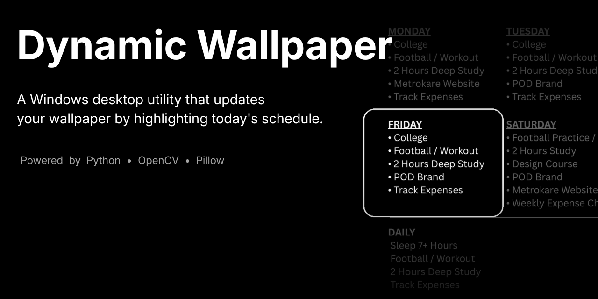
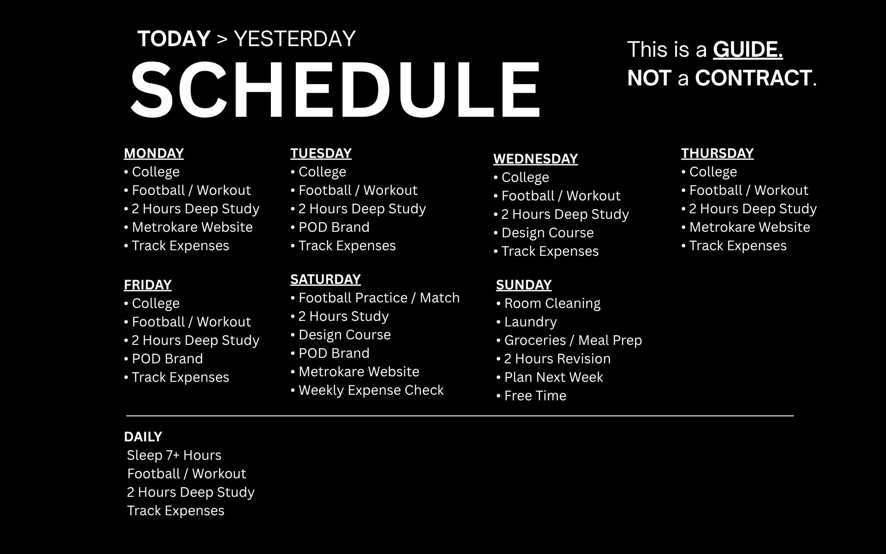
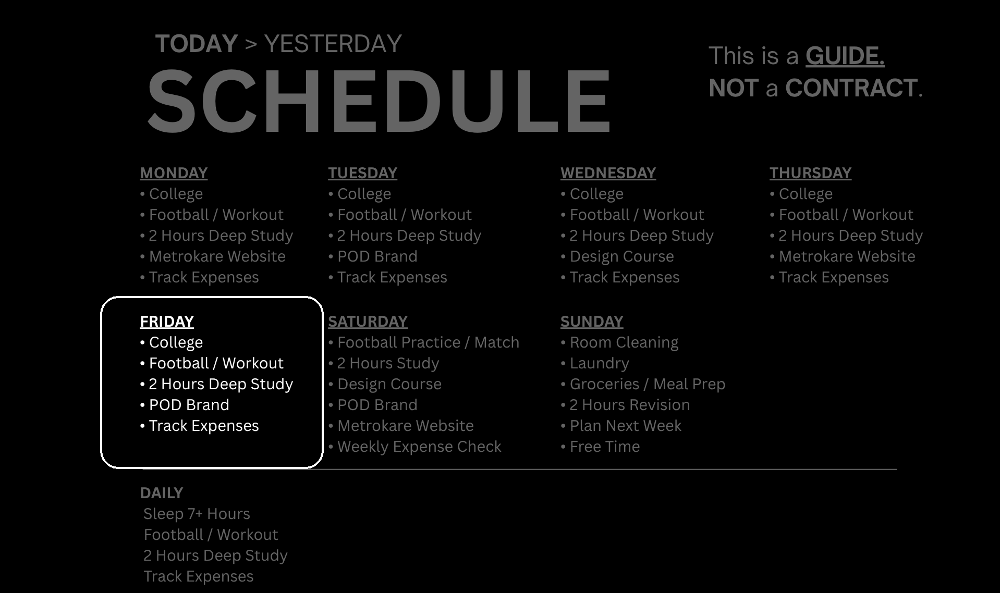
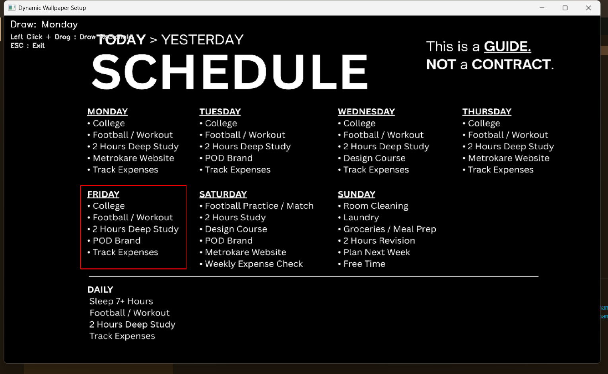

<p align="center">
  
</p>

<p align="center">
A Windows desktop utility that automatically updates your wallpaper by highlighting today's schedule.
</p>

<p align="center">


</p>

---

## 💡 Introduction

I originally used a similar schedule wallpaper on my phone's lock screen. During exam season, it turned out to be an unexpectedly useful reminder—every time I unlocked my phone, I knew exactly what I was supposed to study that day.

As I started spending more time working on my laptop than on my phone, I wanted the same idea on my desktop. I noticed that without a clear goal in front of me, it was far too easy to get distracted, waste time scrolling, or keep postponing work. Since most of my daily tasks follow a fairly fixed routine, I thought my desktop could do more than just look good—it could become a reminder of what I should be working on.

Dynamic Wallpaper updates the wallpaper every day by highlighting the schedule for the current day while dimming the rest of the wallpaper. The highlighted area is fully configurable, making it easy to adapt the wallpaper to different layouts or personal workflows.

What started as a small personal productivity tool gradually became an opportunity to learn more about image processing, desktop automation, and building a complete Windows application from scratch.

---

## ✨ What it does

Dynamic Wallpaper updates the desktop wallpaper every day while keeping the workflow simple and configurable.

It currently:

- Automatically detects the current weekday.
- Highlights the corresponding schedule on the wallpaper.
- Dims the rest of the wallpaper to keep today's tasks in focus.
- Lets you configure the highlight area instead of relying on hardcoded coordinates.
- Applies the generated wallpaper automatically on Windows.
- Supports automatic execution through Windows Task Scheduler.
- Generates a new wallpaper every day without requiring manual interaction.

---

## 🖼️ Preview

This is what the wallpaper looks like before and after today's schedule is highlighted.

| Before | After |
|:-------:|:-----:|
|  |  |

Instead of opening a planner or checking a to-do list, the desktop itself becomes a reminder of what needs your attention today.

---

## ⚙️ Setup Tool

One of the goals of this project was to avoid hardcoding the highlight position.

The repository includes a setup tool that lets you select the highlight region directly on the wallpaper. Once the region is selected, the coordinates are saved and reused every time the wallpaper is generated.

This means the same rendering logic can be adapted to different wallpapers without changing the source code.

<p align="center">
    
</p>

---

## 🔄 How it works

Every time Dynamic Wallpaper runs, it follows the same process:

1. Detect the current weekday.
2. Load the base wallpaper and configuration files.
3. Highlight the configured region for the current day.
4. Dim the rest of the wallpaper to keep the focus on today's tasks.
5. Save the generated wallpaper.
6. Apply it as the current Windows desktop wallpaper.

Once the setup is complete, the entire process runs automatically without requiring any user interaction.

---

## 📦 Installation

> **Currently supported on Windows only.**

Clone the repository.

```bash
git clone https://github.com/VaradRatnakar/dynamic-wallpaper.git
```

Move into the project directory.

```bash
cd dynamic-wallpaper
```

Install the required dependencies.

```bash
pip install -r requirements.txt
```

Run the setup tool once to configure the highlight region.

```bash
python src/setup.py
```

Finally, run the application.

```bash
python main.py
```

---

## ▶️ Usage

Using the project only requires two steps.

1. Run the setup tool once to select the highlight region on your wallpaper.
2. Run the main application.

Once everything is configured, the wallpaper can be updated manually or automatically using Windows Task Scheduler.

---

## 📝 Configuration

The project stores its configuration inside the `Config` directory.

- `coordinates.json` stores the highlight region selected using the setup tool.
- `settings.json` contains application settings used during rendering.

Most users won't need to edit these files manually, since the setup tool handles the coordinate selection automatically.

---

## 📁 Project Structure

```text
Dynamic Wallpaper/

├── Assets/
│
├── Config/
│   ├── coordinates.json
│   └── settings.json
│
├── Output/
│
├── screenshots/
│   ├── banner.png
│   ├── before.png
│   ├── after.png
│   ├── setup-tool.png
│   └── terminal.png
│
├── src/
│   ├── core/
│   │   ├── config.py
│   │   ├── constants.py
│   │   ├── logger.py
│   │   └── validator.py
│   │
│   ├── renderer.py
│   ├── setup.py
│   └── wallpaper.py
│
├── main.py
├── requirements.txt
├── DynamicWallpaper.spec
├── LICENSE
└── README.md
```

---

## 🚀 What's next?

The current version focuses on a simple idea—making today's priorities visible the moment I sit down at my computer.

I have a few ideas I'd like to explore in future versions, including:

- Countdown timers for exams or important deadlines.
- Progress indicators for long-term goals.
- Better customization for different wallpaper layouts.
- Additional productivity-focused desktop widgets.

The goal is to keep the desktop useful without turning it into another productivity application.

---

## 👨‍💻 Author

Built by **Varad Ratnakar**.

This project started as a personal experiment and gradually became one of my favorite Python projects because it solved a problem I actually faced every day.

If this project gives you ideas for your own workflow or helps you build something similar, I'd love to hear about it.